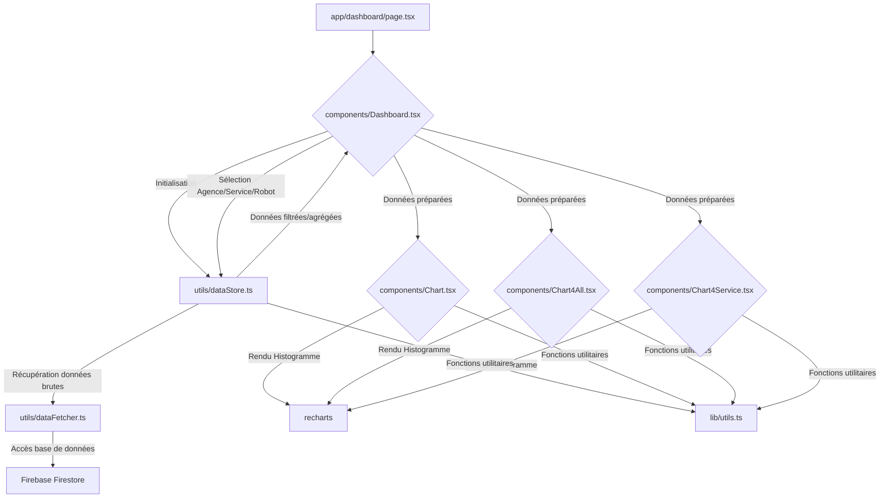

# Analyse Approfondie du Projet Dashboard RPA BBL

## Introduction

Ce document présente une analyse détaillée de l'application "Dashboard RPA BBL". L'objectif est de comprendre en profondeur son fonctionnement, ses mécanismes, les données manipulées et les relations entre les différents composants. Cette analyse servira de base pour une future recréation de l'application avec une source de données différente (SQL Server au lieu de Firebase), tout en conservant la logique métier existante.

## 1. Architecture Générale et Flux de Données

L'application est une application web basée sur Next.js, utilisant React pour l'interface utilisateur. Firebase Firestore est la base de données principale pour le stockage des données.

Le flux de données peut être schématisé comme suit :



**Explication du Flux :**

1.  **`app/dashboard/page.tsx`**: Point d'entrée de la page du tableau de bord. Il s'agit d'un composant Next.js qui importe et rend le composant `Dashboard`.
2.  **`components/Dashboard.tsx`**: C'est le composant central de l'application. Il gère l'état global, l'authentification, les sélections de l'utilisateur (agence, service, robot, mois) et orchestre le chargement et la préparation des données.
3.  **`utils/dataStore.ts`**: Ce module est le gestionnaire de données. Il interagit avec `dataFetcher` pour récupérer les données brutes de Firebase, puis les met en cache en mémoire et fournit des fonctions pour les filtrer et les manipuler. Il est responsable de la logique métier liée à la gestion des données.
4.  **`utils/dataFetcher.ts`**: Ce module contient les fonctions de bas niveau pour interroger directement Firebase Firestore. Il est une couche d'abstraction entre `dataStore` et la base de données.
5.  **`Firebase Firestore`**: La base de données NoSQL où toutes les données de l'application sont stockées (utilisateurs, agences, robots, données de reporting, évolutions, citations, statuts, services).
6.  **`components/Chart.tsx`, `components/Chart4All.tsx`, `components/Chart4Service.tsx`**: Ces composants sont responsables de la visualisation des données sous forme d'histogrammes. Ils reçoivent les données déjà préparées par `Dashboard.tsx` et utilisent la bibliothèque `recharts` pour le rendu.
7.  **`lib/utils.ts`**: Contient des fonctions utilitaires génériques, notamment `formatDuration` pour le formatage des durées.

## 2. Détail des Composants et Fichiers Clés

### 2.1. `lib/firebase.ts`

*   **Rôle**: Initialisation de l'application Firebase et exposition des instances de services Firebase (Firestore et Authentication).
*   **Mécanisme**:
    *   Importe `initializeApp` de `firebase/app`, `getFirestore` de `firebase/firestore`, et `getAuth` de `firebase/auth`.
    *   Configure l'application Firebase avec les clés d'API et autres identifiants stockés dans les variables d'environnement (`process.env.NEXT_PUBLIC_Firebase_...`).
    *   Initialise l'application Firebase via `initializeApp(firebaseConfig)`.
    *   Exporte `db` (instance de Firestore) et `auth` (instance d'Authentication) pour être utilisés dans d'autres modules.
*   **Variables/Données**: `firebaseConfig` (objet de configuration Firebase), `app` (instance de l'application Firebase), `db` (instance Firestore), `auth` (instance Authentication).
*   **Fichiers Impliqués**: `.env` (pour les variables d'environnement Firebase).

### 2.2. `utils/dataFetcher.ts`

*   **Rôle**: Service de récupération des données brutes depuis Firebase Firestore. Il ne gère pas de cache ni de calculs complexes, se concentrant uniquement sur les requêtes directes.
*   **Mécanismes**:
    *   Toutes les fonctions utilisent `collection`, `getDocs`, `query`, `where` de `firebase/firestore` pour interroger la base de données.
    *   **`fetchAgenciesByIds(agencyIds: string[])`**: Récupère les documents d'agences par leur `idAgence`.
    *   **`fetchAllEvolutions()`**: Récupère toutes les évolutions et applique une logique pour ne conserver que la dernière version de chaque robot (celle avec le `statut` le plus élevé).
    *   **`fetchEvolutionsByProgram(programId: string, selectedMonth: string = 'N')`**: Récupère les évolutions pour un robot spécifique sur une période donnée. Utilise `getMonthRange` pour définir les bornes de date.
    *   **`fetchRandomQuote()`**: Récupère une citation aléatoire.
    *   **`fetchStatuts()`**: Récupère la liste des statuts.
    *   **`fetchAllUsers()`, `fetchUser(userId: string)`**: Récupèrent les données des utilisateurs.
    *   **`fetchDataReportingByAgency(agence: string)`, `fetchAllReportingData()`**: Récupèrent les données de reporting.
    *   **`fetchAllServices()`**: Récupère la liste des services.
    *   **`formatNumber(num: number)`**: Fonction utilitaire pour formater les nombres (ex: convertir les décimales en minutes).
*   **Variables/Données**: `allRobotsByAgency` (variable globale temporaire), interfaces `UserData`, `Agency`, `Evolution`, `FirestoreQuote`, `Quote`.
*   **Fichiers Impliqués**: `lib/firebase.ts` (pour l'instance `db`).

### 2.3. `utils/dataStore.ts`

*   **Rôle**: Gestion centralisée du cache des données, coordination des opérations Firestore (via `dataFetcher`), filtrage avancé et calculs de reporting. C'est le "modèle" de données de l'application.
*   **Mécanismes**:
    *   **Variables de cache globales**: `cachedAgencies`, `cachedAllAgencies`, `cachedRobots4Agencies`, `cachedRobots`, `cachedServices`, `cachedReportingData`. Ces variables stockent les données en mémoire pour éviter des requêtes répétées à Firebase.
    *   **`initializeData(userId: string)`**: Fonction d'initialisation principale.
        *   Appelle `fetchUserData` (de `dataFetcher`) pour obtenir les agences de l'utilisateur.
        *   Appelle `loadUserAgencies` pour peupler `cachedAgencies` avec les agences de l'utilisateur (ou toutes si admin).
        *   Appelle `loadAllRobotsForAgencies` pour peupler `cachedRobots` avec les robots des agences de l'utilisateur.
        *   Appelle `initializeReportingData` pour charger et structurer les données de reporting.
    *   **`loadAllAgencies()`**: Charge toutes les agences dans `cachedAllAgencies`.
    *   **`loadUserAgencies(agencyNames: string[])`**: Charge les agences spécifiques à l'utilisateur dans `cachedAgencies`, en ajoutant une agence "TOUT" par défaut.
    *   **`loadAllRobots()`**: Charge tous les robots de la collection `robots_et_baremes` dans `cachedRobots4Agencies`. Il enrichit ces objets `Program` avec les données de reporting (`currentMonth`, `previousMonth`) en les liant via `id_robot`.
    *   **`loadAllRobotsForAgencies()`**: Charge les robots pour les agences spécifiques de l'utilisateur (excluant "TOUT") et les stocke dans `cachedRobots`.
    *   **`initializeReportingData()`**: Récupère toutes les données de reporting via `fetchAllReportingData` (de `dataFetcher`), puis les agrège et les structure par mois (courant, N-1, N-2, N-3) dans `cachedReportingData`. Calcule également les totaux mensuels pour chaque période.
    *   **Fonctions de récupération/filtrage**: `getCachedAgencies()`, `getRobotsByAgency()`, `getRobotsByService()`, `getRobotsByAgencyAndService()`, `getReportingData()`, `getTotalCurrentMonth()`, `getRobotTotalCurrentMonth()`, etc. Ces fonctions permettent d'accéder aux données mises en cache avec différents filtres.
    *   **`resetCache()`**: Réinitialise toutes les variables de cache.
*   **Variables/Données**: Interfaces `Agency`, `Program`, `ReportingEntry`, `MonthlyLabels`, `MonthlyData`. Variables de cache globales.
*   **Fichiers Impliqués**: `lib/firebase.ts` (pour `db`), `utils/dataFetcher.ts` (pour les fonctions de récupération), `lib/utils.ts` (pour `formatDuration`).

### 2.4. `components/Dashboard.tsx`

*   **Rôle**: Composant principal du tableau de bord. Il gère l'état de l'application, les interactions utilisateur (sélections), et la préparation des données pour les composants de visualisation.
*   **Mécanismes**:
    *   **Gestion de l'état**: Utilise `useState` pour gérer `showAllRobots`, `agencies`, `selectedMonth`, `selectedAgency`, `selectedService`, `programs`, `selectedRobot`, `selectedRobotData`, `historiqueData`, `robotData`, `robotData1`, `error`, `isLoading`, `OpenFormNewOrder`, `useChart4All`, `isUserSelectingService`, et les totaux mensuels.
    *   **Authentification**: Un `useEffect` redirige l'utilisateur vers la page d'accueil si `userData` n'est pas présent dans `localStorage`.
    *   **Initialisation des données**: Un `useEffect` appelle `initializeData` (de `dataStore`) au montage du composant pour charger toutes les données nécessaires. Il met à jour les états locaux avec les données récupérées.
    *   **`handleAgencyChange(agencyId: string)`**: Gère le changement d'agence. Met à jour `selectedAgency`, réinitialise `selectedService`, et recharge les `programs` pertinents via `getRobotsByAgency` ou `getRobotsByAgencyAndService` de `dataStore`.
    *   **`handleProgramChange(robotID: string)`**: Gère le changement de robot. Met à jour `selectedRobot` et `selectedRobotData`.
    *   **Préparation des données pour les graphiques**: Un `useEffect` écoute les changements de `selectedRobotData` et `selectedMonth`.
        *   Si `selectedRobotData.robot` est "TOUT", il agrège les données de reporting de tous les robots pertinents (filtrés par agence et service) pour le `selectedMonth`.
        *   Il parcourt les robots et leurs données de reporting quotidiennes (`entry[dateKey]`) pour calculer les totaux quotidiens pour les gains de temps et les autres types de gains.
        *   Les valeurs pour les robots de type "temps" sont multipliées par `temps_par_unite` pour obtenir le gain total.
        *   Le résultat est un objet `mergedDataType1` qui contient les totaux quotidiens agrégés pour le mois sélectionné. Cet objet est passé comme prop `data1` à `Chart4All.tsx`.
        *   `setUseChart4All(true)` est appelé pour rendre `Chart4All`.
    *   **Cas Robot Spécifique (pour `Chart.tsx`)**:
        *   Si un robot spécifique est sélectionné, le `Dashboard` récupère l'entrée de reporting correspondante pour ce robot et le `selectedMonth` directement depuis `cachedReportingData` (dans `dataStore.ts`).
        *   Les totaux mensuels pour ce robot spécifique (`totalCurrentMonth_Chart`, etc.) sont également récupérés.
        *   Ces données sont stockées dans `robotData` et passées au composant `Chart.tsx`.
        *   `setUseChart4All(false)` est appelé pour rendre `Chart`.
    *   **Rendu conditionnel**: Utilise l'état `useChart4All` pour afficher soit `Chart4All` (vue agrégée) soit `Chart` (vue par robot).
    *   **Autres composants**: Rend `AgencySelector`, `ServiceSelector`, `ProgramSelector`, `MergedRequestForm` (pour les demandes), et `ProgramTable` (pour l'historique des évolutions).
*   **Variables/Données**: Tous les états locaux mentionnés ci-dessus.
*   **Fichiers Impliqués**: `next/navigation`, `react`, `ProgramSelector.tsx`, `Chart.tsx`, `ProgramTable.tsx`, `Chart4All.tsx`, `MergedRequestForm.tsx`, `AgencySelector.tsx`, `ServiceSelector.tsx`, `utils/dataFetcher.ts`, `utils/dataStore.ts`.

### 2.5. `components/Chart.tsx`, `components/Chart4All.tsx`, `components/Chart4Service.tsx`

*   **Rôle**: Composants de présentation responsables du rendu des histogrammes et des indicateurs clés.
*   **Mécanismes Communs**:
    *   Importent `Bar`, `BarChart`, `ResponsiveContainer`, `XAxis`, `YAxis`, `Tooltip`, `ReferenceLine` de `recharts`.
    *   Importent `formatDuration` de `lib/utils`.
    *   Définissent l'interface `CustomizedAxisTickProps` et le composant `CustomizedAxisTick` pour personnaliser l'affichage des labels de l'axe X (rotation pour lisibilité).
    *   **Préparation des `chartData`**: Pour chaque composant, un tableau `chartData` est généré pour les 31 jours du mois. Pour chaque jour, la valeur correspondante est extraite de la prop `data` (ou `data1`).
    *   **Rendu `BarChart`**:
        *   `data={chartData}`: Lie le graphique aux données préparées.
        *   `XAxis`:
            *   `dataKey="date"`: Utilise la propriété `date` de `chartData` pour les labels de l'axe X.
            *   `tick={<CustomizedAxisTick ... />}`: Utilise un composant personnalisé pour faire pivoter les labels des dates, évitant le chevauchement.
        *   `YAxis`:
            *   `tickFormatter={(value: number) => formatDuration(value)}`: Pour les gains de temps, formate les valeurs de l'axe Y en un format lisible (ex: "1h 30m"). Pour les autres types, affiche la valeur brute.
        *   `Tooltip`:
            *   `content={({ payload, label }) => { ... }}`: Personnalise le contenu de l'infobulle.
            *   Si `robotType` est "temps", il affiche le "Gain" (formaté par `formatDuration`) et le "Nb traitement" (calculé à partir du gain et de `temps_par_unite`).
            *   Sinon, il affiche le nombre d'exécutions.
        *   `ReferenceLine`: Une ligne horizontale à y=0.
        *   `Bar`:
            *   `dataKey="valeur"`: Indique que la hauteur des barres est basée sur la propriété `valeur` de `chartData`.
            *   `fill`: La couleur des barres est définie dynamiquement (bleu pour "temps", orange pour "autre").
            *   `label`: Affiche la valeur au-dessus de chaque barre, formatée de la même manière que l'axe Y.
            *   `activeBar`: Change la couleur de la barre survolée.
*   **Spécificités de `Chart.tsx`**:
    *   Affiche un histogramme pour un **robot spécifique**.
    *   Prend en props `robotType`, `data`, `selectedAgency`, `selectedMonth`, `setSelectedMonth`, et les totaux mensuels (`totalCurrentMonth`, etc.).
    *   Affiche des informations détaillées sur le robot (description, problème, solution apportée).
    *   Les indicateurs mensuels sont spécifiques au robot sélectionné.
*   **Spécificités de `Chart4All.tsx`**:
    *   Affiche un histogramme agrégé de "Gain de temps" pour **tous les robots** (ou tous les robots filtrés par agence/service).
    *   Prend en props `robotType`, `data1`, et les totaux mensuels agrégés.
    *   Inclut une section "Le saviez-vous ?" qui fait défiler des informations sur d'autres robots (ceux dont le `type_gain` n'est pas 'temps') en utilisant `cachedRobots4Agencies` de `dataStore`.
*   **Spécificités de `Chart4Service.tsx`**:
    *   Affiche un histogramme de "Gain de temps" pour un **service spécifique**.
    *   Prend en props `service` et `data1`.
    *   Affiche les totaux mensuels pour ce service.
*   **Variables/Données**: Props `data`, `data1`, `robotType`, `selectedMonth`, `totalCurrentMonth`, etc. `chartData` (données formatées pour `recharts`).
*   **Fichiers Impliqués**: `recharts`, `lib/utils.ts`, `utils/dataStore.ts` (pour `Chart4All.tsx`).

## 3. Workflow et Cinématique Détaillés

Le workflow de l'application est centré sur l'affichage dynamique des données de performance des robots RPA, avec des options de filtrage et d'agrégation.

1.  **Démarrage de l'Application / Accès au Dashboard**:
    *   L'utilisateur accède à l'URL `/dashboard`.
    *   `app/dashboard/page.tsx` est chargé et rend le composant `Dashboard`.
2.  **Initialisation des Données (Composant `Dashboard`)**:
    *   Le `useEffect` dans `Dashboard.tsx` vérifie l'authentification. Si l'utilisateur n'est pas connecté, il est redirigé vers la page de connexion.
    *   Si l'utilisateur est connecté, la fonction `initializeData(username)` de `utils/dataStore.ts` est appelée.
    *   `initializeData` effectue les opérations suivantes :
        *   `fetchUserData(username)` (dans `dataFetcher.ts`) récupère les informations de l'utilisateur depuis Firestore, y compris les IDs des agences auxquelles il est associé.
        *   `loadUserAgencies(userAgenceIds)` (dans `dataStore.ts`) utilise `fetchAgenciesByIds` (dans `dataFetcher.ts`) pour récupérer les détails des agences de l'utilisateur et les stocke dans `cachedAgencies`. Une agence "TOUT" est ajoutée par défaut.
        *   `loadAllRobotsForAgencies()` (dans `dataStore.ts`) utilise des requêtes Firestore pour récupérer tous les robots (`robots_et_baremes`) associés aux agences de l'utilisateur et les stocke dans `cachedRobots`.
        *   `initializeReportingData()` (dans `dataStore.ts`) utilise `fetchAllReportingData()` (dans `dataFetcher.ts`) pour récupérer toutes les données de reporting. Ces données sont ensuite traitées, agrégées par mois (courant, N-1, N-2, N-3) et stockées dans `cachedReportingData`. Les totaux mensuels globaux sont également calculés et mis à jour dans les états du `Dashboard`.
    *   Une fois l'initialisation terminée, `isLoading` passe à `false`, et les sélecteurs (agence, programme) sont peuplés.
3.  **Interaction Utilisateur - Sélection d'Agence**:
    *   L'utilisateur sélectionne une agence via `AgencySelector`.
    *   La fonction `handleAgencyChange` dans `Dashboard.tsx` est déclenchée.
    *   `selectedAgency` est mis à jour.
    *   `getRobotsByAgency(agencyId)` (de `dataStore.ts`) est appelée pour obtenir la liste des robots disponibles pour l'agence sélectionnée. Cette liste est stockée dans l'état `programs`.
    *   Le premier robot de la liste (souvent "TOUT") est automatiquement sélectionné (`setSelectedRobot`, `setSelectedRobotData`).
4.  **Interaction Utilisateur - Sélection de Service (Optionnel)**:
    *   L'utilisateur peut filtrer par service via `ServiceSelector`.
    *   `setSelectedService` est mis à jour.
    *   Le `useEffect` qui écoute `selectedAgency` et `selectedService` est déclenché, rechargeant les `programs` via `getRobotsByAgencyAndService`.
5.  **Interaction Utilisateur - Sélection de Robot/Programme**:
    *   L'utilisateur sélectionne un robot spécifique via `ProgramSelector`.
    *   La fonction `handleProgramChange` dans `Dashboard.tsx` est déclenchée.
    *   `selectedRobot` et `selectedRobotData` sont mis à jour avec les détails du robot sélectionné.
6.  **Chargement et Préparation des Données pour les Graphiques (Composant `Dashboard`)**:
    *   Un `useEffect` dans `Dashboard.tsx` est déclenché chaque fois que `selectedRobotData` ou `selectedMonth` change.
    *   **Cas "TOUT" (Vue agrégée)**:
        *   Si `selectedRobotData.robot` est "TOUT", le `Dashboard` agrège les données de reporting de tous les robots pertinents (filtrés par agence et service) pour le `selectedMonth`.
        *   Il parcourt les robots et leurs données de reporting quotidiennes (`entry[dateKey]`) pour calculer les totaux quotidiens pour les gains de temps et les autres types de gains.
        *   Les valeurs pour les robots de type "temps" sont multipliées par `temps_par_unite` pour obtenir le gain total.
        *   Le résultat est un objet `mergedDataType1` qui contient les totaux quotidiens agrégés pour le mois sélectionné. Cet objet est passé comme prop `data1` à `Chart4All.tsx`.
        *   `setUseChart4All(true)` est appelé pour rendre `Chart4All`.
    *   **Cas Robot Spécifique (pour `Chart.tsx`)**:
        *   Si un robot spécifique est sélectionné, le `Dashboard` récupère l'entrée de reporting correspondante pour ce robot et le `selectedMonth` directement depuis `cachedReportingData` (dans `dataStore.ts`).
        *   Les totaux mensuels pour ce robot spécifique (`totalCurrentMonth_Chart`, etc.) sont également récupérés.
        *   Ces données sont stockées dans `robotData` et passées au composant `Chart.tsx`.
        *   `setUseChart4All(false)` est appelé pour rendre `Chart`.
7.  **Rendu des Histogrammes (Composants `Chart.tsx`, `Chart4All.tsx`, `Chart4Service.tsx`)**:
    *   Les composants de graphique reçoivent les props (`data`, `data1`, `robotType`, totaux mensuels, etc.).
    *   Ils construisent un tableau `chartData` pour les 31 jours du mois, en extrayant les valeurs quotidiennes de la prop `data`/`data1`.
    *   Ils utilisent `recharts` pour dessiner l'histogramme:
        *   L'axe X affiche les dates (avec rotation des labels).
        *   L'axe Y affiche les valeurs (gain de temps ou nombre d'exécutions), formatées par `formatDuration` si nécessaire.
        *   Les tooltips sont personnalisés pour afficher des détails contextuels (gain, nombre de traitements).
        *   Les barres sont colorées différemment selon le type de gain.
    *   Les indicateurs mensuels sont affichés sous le graphique, permettant de changer le `selectedMonth` et de rafraîchir le graphique.
    *   `Chart.tsx` affiche également une section de description détaillée du robot.
    *   `Chart4All.tsx` affiche la section "Le saviez-vous ?" avec un diaporama d'informations sur d'autres robots.
    *   `Chart4Service.tsx` est une vue spécifique pour un service, avec un histogramme et des totaux pour ce service.
8.  **Gestion des Formulaires de Demande**:
    *   Le bouton "Nouvelle demande" dans `Dashboard.tsx` ouvre le composant `MergedRequestForm`.
    *   Ce formulaire permet de soumettre de nouvelles demandes ou des évolutions, mais la logique de soumission (écriture dans Firestore) n'est pas détaillée dans les fichiers analysés ici.

## 4. Focus sur la Génération des Histogrammes

La génération des histogrammes est un processus en plusieurs étapes, impliquant la récupération, la préparation et le rendu des données.

### 4.1. Données Source

Les données brutes proviennent de la collection `reporting` dans Firebase Firestore. Chaque document de `reporting` contient des informations sur un programme (robot) pour un mois donné, avec des champs pour chaque jour du mois (ex: "01/07/2025", "02/07/2025", etc.) représentant le nombre d'unités traitées ou le gain de temps.

Exemple de structure de données de reporting (simplifiée) :

```json
{
  "AGENCE": "Agence A",
  "NOM PROGRAMME": "Robot X",
  "NB UNITES DEPUIS DEBUT DU MOIS": "1200",
  "NB UNITES MOIS N-1": "1100",
  "NB UNITES MOIS N-2": "1000",
  "NB UNITES MOIS N-3": "900",
  "01/07/2025": "50",
  "02/07/2025": "70",
  // ... jusqu'à "31/07/2025"
  "temps_par_unite": "1.5", // Temps gagné par unité (pour les robots de type 'temps')
  "type_gain": "temps" // ou "autre"
}
```

### 4.2. Récupération et Mise en Cache (`utils/dataStore.ts` et `utils/dataFetcher.ts`)

1.  **`initializeReportingData()` (dans `dataStore.ts`)**:
    *   Appelle `fetchAllReportingData()` (dans `dataFetcher.ts`) pour récupérer *tous* les documents de la collection `reporting`.
    *   Ces données brutes sont ensuite traitées et stockées dans `cachedReportingData`. `cachedReportingData` est un objet qui contient les données de reporting pour le mois courant (`currentMonth`), le mois précédent (`prevMonth1`), et ainsi de suite jusqu'à `prevMonth3`.
    *   Les totaux mensuels (`totalCurrentMonth`, `totalPrevMonth1`, etc.) sont calculés à ce stade pour l'ensemble des données de reporting.

### 4.3. Préparation des Données pour le Rendu (`components/Dashboard.tsx`)

Le composant `Dashboard.tsx` est responsable de la sélection et de la transformation des données brutes du cache en un format utilisable par les composants de graphique.

*   **Logique de sélection du mois**:
    *   L'état `selectedMonth` (`'N'`, `'N-1'`, `'N-2'`, `'N-3'`) détermine quel mois afficher.
    *   Une logique de calcul de date est appliquée pour déterminer le mois et l'année à afficher, en tenant compte du décalage et d'un cas particulier pour le 1er jour du mois.
*   **Cas "TOUT" (pour `Chart4All.tsx`)**:
    *   Lorsque l'utilisateur sélectionne "TOUT" comme robot, `Dashboard.tsx` doit agréger les données de reporting de *tous* les robots pertinents (filtrés par agence et service) pour le `selectedMonth`.
    *   Il parcourt les robots et leurs données de reporting quotidiennes (`entry[dateKey]`) pour calculer les totaux quotidiens pour les gains de temps et les autres types de gains.
    *   Les valeurs pour les robots de type "temps" sont multipliées par `temps_par_unite` pour obtenir le gain total.
    *   Le résultat est un objet `mergedDataType1` qui contient les totaux quotidiens agrégés pour le mois sélectionné. Cet objet est passé comme prop `data1` à `Chart4All.tsx`.
*   **Cas Robot Spécifique (pour `Chart.tsx`)**:
    *   Si un robot spécifique est sélectionné, le `Dashboard` récupère l'entrée de reporting correspondante pour ce robot et le `selectedMonth` directement depuis `cachedReportingData` (dans `dataStore.ts`).
    *   Les totaux mensuels pour ce robot spécifique (`totalCurrentMonth_Chart`, etc.) sont également récupérés.
    *   Ces données sont stockées dans `robotData` et passées au composant `Chart.tsx`.

### 4.4. Rendu Graphique (`components/Chart.tsx`, `components/Chart4All.tsx`, `components/Chart4Service.tsx`)

Ces composants reçoivent les données préparées et utilisent `recharts` pour générer l'histogramme.

1.  **Construction de `chartData`**:
    *   Dans chaque composant `Chart`, un tableau `chartData` est créé. Ce tableau est la source de données pour `recharts`.
    *   Il est généré pour 31 jours (représentant les jours du mois).
    *   Pour chaque jour `i` (de 1 à 31), une `dateKey` est construite (ex: "01/07/2025").
    *   La `valeur` pour ce jour est extraite de la prop `data` (ou `data1`) en utilisant cette `dateKey`. Si la valeur n'existe pas ou est nulle, elle est définie à 0.
    *   Chaque élément de `chartData` est un objet `{ date: string, valeur: number }`.
2.  **Configuration de `BarChart`**:
    *   `data={chartData}`: Lie le graphique aux données préparées.
    *   `XAxis`:
        *   `dataKey="date"`: Utilise la propriété `date` de `chartData` pour les labels de l'axe X.
        *   `tick={<CustomizedAxisTick ... />}`: Utilise un composant personnalisé pour faire pivoter les labels des dates, évitant le chevauchement.
    *   `YAxis`:
        *   `tickFormatter={(value: number) => formatDuration(value)}`: Pour les gains de temps, formate les valeurs de l'axe Y en un format lisible (ex: "1h 30m"). Pour les autres types, affiche la valeur brute.
    *   `Tooltip`:
        *   `content={({ payload, label }) => { ... }}`: Personnalise le contenu de l'infobulle.
        *   Si `robotType` est "temps", il affiche le "Gain" (formaté par `formatDuration`) et le "Nb traitement" (calculé à partir du gain et de `temps_par_unite`).
        *   Sinon, il affiche le nombre d'exécutions.
    *   `ReferenceLine`: Une ligne horizontale à y=0.
    *   `Bar`:
        *   `dataKey="valeur"`: Indique que la hauteur des barres est basée sur la propriété `valeur` de `chartData`.
        *   `fill`: La couleur des barres est définie dynamiquement (bleu pour "temps", orange pour "autre").
        *   `label`: Affiche la valeur au-dessus de chaque barre, formatée de la même manière que l'axe Y.
        *   `activeBar`: Change la couleur de la barre survolée.

### 4.5. Relations entre les Éléments

*   **`Dashboard`** est le chef d'orchestre, il dépend de `dataStore` pour la gestion des données et de `Chart`, `Chart4All`, `Chart4Service` pour l'affichage.
*   **`dataStore`** dépend de `dataFetcher` pour l'accès à la base de données et de `lib/firebase` pour l'instance `db`. Il fournit les données structurées et mises en cache au `Dashboard`.
*   **`dataFetcher`** dépend uniquement de `lib/firebase` pour l'accès à Firestore.
*   **Les composants `Chart`** dépendent des données préparées par le `Dashboard` et de `lib/utils` pour le formatage.
*   **`lib/utils`** est un module utilitaire indépendant.

## 5. Impact du Changement de Source de Données (Firebase vers SQL Server)

Le passage de Firebase à SQL Server nécessitera des modifications significatives, principalement dans les couches de récupération et de gestion des données.

*   **`lib/firebase.ts`**: Ce fichier deviendra obsolète ou devra être remplacé par un nouveau module d'initialisation de la connexion à SQL Server.
*   **`utils/dataFetcher.ts`**: C'est le module qui subira les changements les plus importants. Toutes les fonctions actuelles (`fetchAgenciesByIds`, `fetchAllEvolutions`, `fetchDataReportingByAgency`, etc.) devront être réécrites pour interroger SQL Server.
    *   Il faudra choisir un pilote Node.js pour SQL Server (ex: `mssql`).
    *   Les requêtes Firestore (`collection`, `getDocs`, `query`, `where`) devront être remplacées par des requêtes SQL (ou des appels à un ORM si utilisé).
    *   Les structures de données retournées par ces fonctions (`Agency`, `Program`, `ReportingEntry`, etc.) devront rester les mêmes pour minimiser l'impact sur `dataStore`. Cela signifie qu'il faudra mapper les résultats des requêtes SQL aux interfaces TypeScript existantes.
*   **`utils/dataStore.ts`**: Ce module sera également impacté, mais dans une moindre mesure. Les fonctions d'initialisation (`initializeData`, `loadAllAgencies`, `loadUserAgencies`, `loadAllRobots`, `initializeReportingData`) devront être mises à jour pour appeler les nouvelles fonctions de `dataFetcher.ts`. La logique de mise en cache, de filtrage et d'agrégation des données (par exemple, la construction de `cachedReportingData` et les fonctions `get...`) pourra être conservée telle quelle, car elle opère sur les données déjà récupérées et structurées en mémoire.
*   **`components/Dashboard.tsx`**: Ce composant devrait nécessiter des modifications minimales. Il interagit avec `dataStore.ts` via des interfaces et fonctions bien définies. Tant que `dataStore.ts` continue de fournir les données dans le même format, `Dashboard.tsx` ne devrait pas avoir besoin de changements majeurs.
*   **Composants `Chart.tsx`, `Chart4All.tsx`, `Chart4Service.tsx`**: Ces composants ne devraient pas être affectés du tout, car ils reçoivent les données déjà préparées et formatées par `Dashboard.tsx`. Leur logique de rendu graphique est indépendante de la source de données sous-jacente.

En résumé, l'effort de migration se concentrera principalement sur la couche d'accès aux données (`dataFetcher.ts`) et son intégration avec la couche de gestion des données (`dataStore.ts`), en veillant à maintenir la compatibilité des interfaces de données pour les couches supérieures de l'application.
