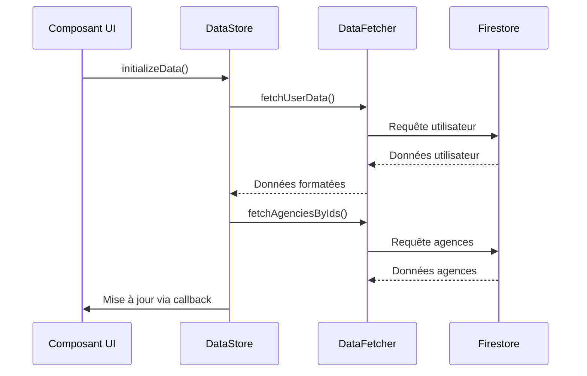

# Analyse des Fichiers de Gestion de Données

## Fichier utils/dataStore.ts

### Rôle Principal
Gestion centralisée du cache des données et coordination des opérations Firestore pour le dashboard RPA BBL.

### Fonctionnalités Clés
1. **Gestion du Cache**:
   - Maintient des copies locales des données (agences, robots, reporting)
   - Optimise les performances en réduisant les appels à Firestore

2. **Filtrage Avancé**:
   - Filtre les robots par agence et service
   - Gère les cas spéciaux comme "TOUT" pour afficher toutes les données

3. **Synchronisation UI**:
   - Fournit des callbacks pour mettre à jour les composants React
   - Gère l'état d'initialisation des données

4. **Calculs**:
   - Effectue les calculs de reporting (temps gagné, etc.)
   - Transforme les données brutes en structures utilisables

### Structures de Données
```typescript
interface Agency {
  idAgence: string;
  nomAgence: string;
  libelleAgence?: string;
}

interface Program {
  // Structure complète des robots RPA
  // (20+ champs incluant métadonnées et reporting)
}
```

### Variables Globales
- `cachedAgencies`: Agences accessibles
- `cachedRobots`: Robots filtrés
- `cachedReportingData`: Données calculées

---

## Fichier utils/dataFetcher.ts

### Rôle Principal
Service de récupération des données Firestore avec des requêtes spécifiques.

### Fonctionnalités Clés
1. **Requêtes Ciblées**:
   - Récupère des entités individuelles (agences, utilisateurs)
   - Effectue des requêtes filtrées (par programme, statut)

2. **Transformations**:
   - Convertit les données Firestore en structures typées
   - Formate les dates et nombres

3. **Gestion d'Erreurs**:
   - Retourne des tableaux vides en cas d'erreur
   - Log les erreurs dans la console

### Différences avec dataStore.ts
| Fonctionnalité       | dataStore.ts | dataFetcher.ts |
|----------------------|-------------|---------------|
| Gestion du cache     | ✅          | ❌            |
| Calculs complexes    | ✅          | ❌            |
| Callbacks UI         | ✅          | ❌            |
| Requêtes directes    | ❌          | ✅            |

---

## Workflow d'Interaction



## Best Practices
1. **dataStore.ts** doit être utilisé pour:
   - Les données nécessitant un cache
   - Les opérations complexes
   - La synchronisation avec l'UI

2. **dataFetcher.ts** doit être utilisé pour:
   - Les requêtes ponctuelles
   - Les récupérations simples
   - Les transformations basiques