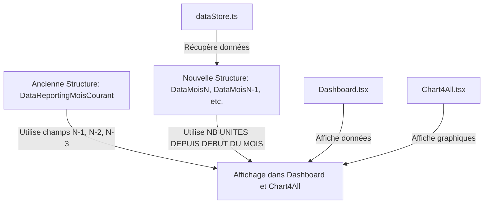

# Analyse des modifications pour le nouveau modèle de données

## Contexte
Le modèle de données actuel utilise une collection unique `DataReportingMoisCourant` avec des champs comme `NB UNITES MOIS N-1`, `NB UNITES MOIS N-2` et `NB UNITES MOIS N-3`. Le nouveau modèle introduit des collections séparées : `DataMoisN`, `DataMoisN-1`, `DataMoisN-2` et `DataMoisN-3`, chacune contenant le champ `NB UNITES DEPUIS DEBUT DU MOIS`. Les modifications visent à remplacer les anciennes références par les nouvelles collections.

## Fichiers impactés et modifications détaillées

### 1. Fichier : utils/dataStore.ts
   - **Description des changements :** Ce fichier gère le cache et la récupération des données Firestore. Les fonctions comme `loadAllRobots` et `initializeReportingData` accèdent actuellement à `cachedReportingData` qui utilise les champs obsolètes. Il faut modifier les requêtes pour utiliser les nouvelles collections et mapper `NB UNITES DEPUIS DEBUT DU MOIS` à partir de `DataMoisN`, `DataMoisN-1`, etc.
   - **Exemple de code potentiel :**
     - Avant :
       ```
       const reportingData = cachedReportingData.find(
         report => report['AGENCE'] + '_' + report['NOM PROGRAMME'] === robot.id_robot
       );
       if (reportingData) {
         return {
           ...robot,
           currentMonth: reportingData['NB UNITES DEPUIS DEBUT DU MOIS'],
           previousMonth: reportingData['NB UNITES MOIS N-1']
         };
       }
       ```
     - Après :
       ```
       const currentMonthData = await fetchFromCollection('DataMoisN', robot['AGENCE'], robot['NOM PROGRAMME']);
       const previousMonthData = await fetchFromCollection('DataMoisN-1', robot['AGENCE'], robot['NOM PROGRAMME']);
       return {
         ...robot,
         currentMonth: currentMonthData['NB UNITES DEPUIS DEBUT DU MOIS'],
         previousMonth: previousMonthData['NB UNITES DEPUIS DEBUT DU MOIS']
       };
       ```
     - **Raison :** Cela assure que les données sont récupérées des collections appropriées sans dépendre des champs dépréciés.

### 2. Fichier : components/Dashboard.tsx
   - **Description des changements :** Ce composant affiche les données de reporting et les graphiques. Les parties qui utilisent `NB UNITES MOIS N-1`, etc., doivent être mises à jour pour utiliser les valeurs de `NB UNITES DEPUIS DEBUT DU MOIS` des collections correspondantes. Par exemple, dans les useEffect pour le chargement des données, adapter les filtres et les mappings.
   - **Exemple de code potentiel :**
     - Avant :
       ```
       rawData = cachedReportingData.filter(entry => entry['AGENCE'] + "_" + entry['NOM PROGRAMME'] === robot.id_robot)
         .map(entry => ({
           ...entry,
           'NB UNITES DEPUIS DEBUT DU MOIS': String(entry['NB UNITES DEPUIS DEBUT DU MOIS']),
           'NB UNITES MOIS N-1': String(entry['NB UNITES MOIS N-1']),
         }));
       ```
     - Après :
       ```
       rawData = await fetchDataFromCollections([
         { collection: 'DataMoisN', field: 'NB UNITES DEPUIS DEBUT DU MOIS' },
         { collection: 'DataMoisN-1', field: 'NB UNITES DEPUIS DEBUT DU MOIS' }
       ], robot['AGENCE'], robot['NOM PROGRAMME']);
       ```
     - **Raison :** Cela met à jour l'affichage des widgets et des totaux sans interruption.

### 3. Fichier : components/Chart4All.tsx
   - **Description des changements :** Ce composant affiche les graphiques et les totaux mensuels. Les références à `NB UNITES MOIS N-1`, etc., dans le rendu doivent être remplacées par des appels aux nouvelles collections.
   - **Exemple de code potentiel :**
     - Avant :
       ```
       <div>{data1['NB UNITES MOIS N-1'] ? formatDuration(data1['NB UNITES MOIS N-1']) : '0'}</div>
       ```
     - Après :
       ```
       <div>{dataFromNewCollection['NB UNITES DEPUIS DEBUT DU MOIS'] ? formatDuration(dataFromNewCollection['NB UNITES DEPUIS DEBUT DU MOIS']) : '0'}</div>
       ```
     - **Raison :** Assure que les graphiques reflètent les données correctes du mois précédent.

## Diagramme Mermaid pour le flux de données


## Plan de migration
1. Mettre à jour utils/dataStore.ts pour les nouvelles requêtes.
2. Adapter components/Dashboard.tsx et components/Chart4All.tsx pour l'affichage.
3. Tester les fonctionnalités.
4. Supprimer le code obsolète.

## Impact attendu
- Amélioration de la structure des données.
- Risques potentiels : Erreurs de requête si les collections nouvelles ne sont pas correctement configurées.
- Stratégie de test : Vérifier les affichages et les calculs manuellement.