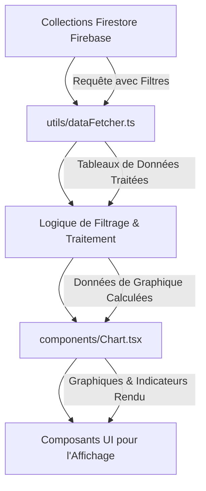

# Description détaillée du modèle de données et du mécanisme de l'application

## Introduction

Ce document décrit le modèle de données utilisé par l'application, les relations entre les différentes collections dans Firecode, ainsi que le mécanisme global de l'application, de la récupération des données jusqu'à leur affichage.

## Modèle de données

### Collections et champs

#### Collection : utilisateurs
- **email** : Adresse email de l'utilisateur
- **password** : Mot de passe de l'utilisateur
- **superieur** : Identifiant du supérieur hiérarchique
- **userAgenceIds** : Liste des IDs des agences associées à l'utilisateur
- **userId** : Identifiant unique de l'utilisateur
- **userName** : Nom de l'utilisateur
- **userService** : Service auquel l'utilisateur est associé
- **validateur** : Statut de validateur de l'utilisateur

#### Collection : agences
- **idAgence** : Identifiant unique de l'agence
- **libelleAgence** : Libellé de l'agence
- **nomAgence** : Nom de l'agence

#### Collection : evolutions
- **Date** : Date de l'évolution
- **Description** : Description de l'évolution
- **Intitulé** : Intitulé de l'évolution
- **Nb_operations_mensuelles** : Nombre d'opérations mensuelles
- **Nombre d'operations mensuelles** : Nombre d'opérations mensuelles (redondant)
- **Robot** : Nom du robot associé
- **Statut** : Statut de l'évolution
- **Temps consomme** : Temps consommé par l'évolution
- **type** : Type d'évolution
- **type_gain** : Type de gain

#### Collection : services
- **nomService** : Nom du service

#### Collection : statut
- **label** : Libellé du statut
- **numero** : Numéro du statut

#### Collection : robots_et_baremes
- **AGENCE** : Agence à laquelle le robot est associé
- **CLEF** : Clé unique du robot
- **DATE MAJ** : Date de dernière mise à jour
- **DESCRIPTION** : Description du robot
- **DESCRIPTION LONG** : Description longue du robot
- **NOM PROGRAMME** : Nom du programme robot
- **PROBLEME** : Problème associé au robot
- **RESULTAT** : Résultat du robot
- **SERVICE** : Service associé au robot
- **TEMPS PAR UNITE** : Temps par unité de traitement
- **TYPE GAIN** : Type de gain
- **TYPE UNITE** : Type d'unité
- **VALIDATEUR** : Validateur du robot
- **VALIDE OUI/NON** : Statut de validation (oui/non)

#### Collection : DataReportingMoisCourant
- **AGENCE** : Agence associée aux données
- **NB UNITES DEPUIS DEBUT DU MOIS** : Nombre d'unités depuis le début du mois
- **NB UNITES MOIS N-1** : Nombre d'unités du mois précédent
- **NB UNITES MOIS N-2** : Nombre d'unités du mois précédent le mois précédent
- **NB UNITES MOIS N-3** : Nombre d'unités du mois précédent le mois précédent le mois précédent
- **NOM PROGRAMME** : Nom du programme associé
- **TEMPS PAR UNITE** : Temps par unité
- **01/06/2025, 02/06/2025, ... 30/06/2025** : Nombre d'unités pour chaque jour du mois (au format jj/MM/AAAA)

## Relations entre les collections

1. **utilisateurs** et **agences** :
   - Un utilisateur peut être associé à plusieurs agences via le champ `userAgenceIds`.
   - Les agences sont récupérées pour un utilisateur spécifique lors de l'initialisation des données.

2. **utilisateurs** et **robots_et_baremes** :
   - Un utilisateur peut avoir des robots associés via son agence et son service.
   - Les robots sont filtrés en fonction de l'agence et du service de l'utilisateur.

3. **agences** et **robots_et_baremes** :
   - Un robot est associé à une agence via le champ `AGENCE`.
   - Les robots sont filtrés par agence pour afficher uniquement ceux pertinents pour l'utilisateur.

4. **robots_et_baremes** et **DataReportingMoisCourant** :
   - Les données de reporting sont associées à un robot via les champs `AGENCE` et `NOM PROGRAMME`.
   - Les données de reporting sont utilisées pour calculer les indicateurs de performance des robots.

5. **evolutions** et **robots_et_baremes** :
   - Une évolution est associée à un robot via le champ `Robot`.
   - Les évolutions sont utilisées pour suivre les changements et les performances des robots.

## Mécanisme de l'application

### 1. Récupération des données

Le processus de récupération des données commence dans `lib/firebase.ts` où l'application Firebase est initialisée. Les données sont ensuite récupérées via des requêtes Firestore dans `utils/dataFetcher.ts`.

#### Exemple de requête Firestore :
```typescript
const usersRef = collection(db, 'utilisateurs');
const q = query(usersRef, where('userId', '==', userId));
const querySnapshot = await getDocs(q);
```

### 2. Filtrage et traitement des données

Les données récupérées sont filtrées et traitées dans `utils/dataFetcher.ts` et `utils/dataStore.ts`. Par exemple, les robots sont filtrés par agence et service, et les données de reporting sont calculées pour afficher les indicateurs de performance.

#### Exemple de filtrage :
```typescript
export function getRobotsByAgencyAndService(agencyId: string, service: string): Program[] {
  let filteredRobots = cachedRobots;

  if (agencyId && agencyId !== 'TOUT') {
    if (agencyId === '99') {
      filteredRobots = cachedRobots;
    } else {
      const agency = cachedAgencies.find(a => a.idAgence === agencyId);
      if (agency) {
        filteredRobots = filteredRobots.filter(robot => robot.agence === agency.nomAgence);
      }
    }
  }

  if (service && service !== 'TOUT') {
    filteredRobots = filteredRobots.filter(robot =>
      (robot.service ?? '').toLowerCase() === service.toLowerCase()
    );
  }

  const toutRobot: Program = {
    id_robot: 'TOUT',
    robot: 'TOUT',
    agence: 'TOUT',
    type_gain: '0',
    temps_par_unite: '0',
    type_unite: ''
  };

  filteredRobots.sort((a, b) => a.robot.localeCompare(b.robot));

  return [toutRobot, ...filteredRobots];
}
```

### 3. Calculs pour l'affichage des histogrammes

Dans `components/Chart.tsx`, les données récupérées sont traitées pour générer les graphiques. Les calculs incluent la multiplication des comptes d'exécution par le temps par unité et le formatage des valeurs.

#### Exemple de calcul :
```typescript
const unitFactor = robot.type_unite !== 'temps' || robot.temps_par_unite === '0' ? 1 : Number(robot.temps_par_unite);
if (robotType === 'temps') {
  totalUnitesMoisCourant_Type1 += (Number(entry['NB UNITES DEPUIS DEBUT DU MOIS']) || 0) * unitFactor;
  totalUnitesMoisN1_Type1 += (Number(entry['NB UNITES MOIS N-1']) || 0);
  totalUnitesMoisN2_Type1 += (Number(entry['NB UNITES MOIS N-2']) || 0);
  totalUnitesMoisN3_Type1 += (Number(entry['NB UNITES MOIS N-3']) || 0);
} else {
  totalUnitesMoisCourant_Type2 += (Number(entry['NB UNITES DEPUIS DEBUT DU MOIS']) || 0);
  totalUnitesMoisN1_Type2 += (Number(entry['NB UNITES MOIS N-1']) || 0);
  totalUnitesMoisN2_Type2 += (Number(entry['NB UNITES MOIS N-2']) || 0);
  totalUnitesMoisN3_Type2 += (Number(entry['NB UNITES MOIS N-3']) || 0);
}
```

### 4. Affichage final

Les données traitées sont affichées dans les composants React comme `Chart.tsx` et `ProgramTable.tsx`. Les graphiques sont générés en utilisant des bibliothèques comme Recharts, et les données sont formatées pour être lisibles par l'utilisateur.

#### Exemple de rendu de graphique :
```typescript
<Chart
  robotType={selectedRobot?.type_gain}
  data={robotData}
  selectedAgency={selectedAgency?.idAgence || ''}
/>
```

## Diagramme Mermaid du flux de données



## Conclusion

Ce document décrit le modèle de données utilisé par l'application, les relations entre les différentes collections, ainsi que le mécanisme global de l'application, de la récupération des données jusqu'à leur affichage. Les données sont récupérées depuis Firebase, filtrées et traitées, puis affichées dans des composants React pour fournir une interface utilisateur interactive et informative.
