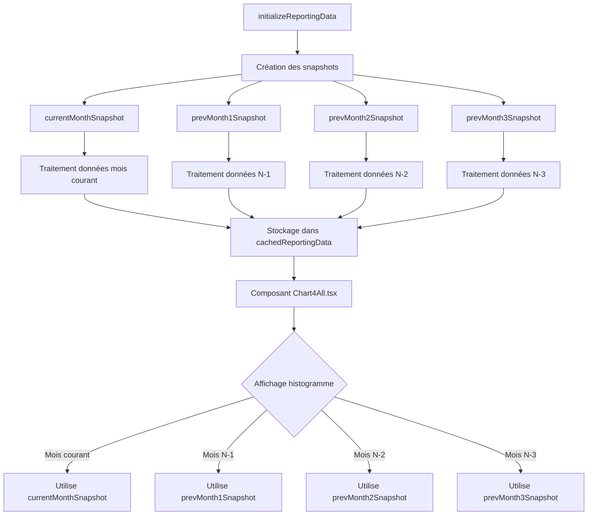

# Analyse du processus de génération d'histogramme

## Modifications dans initializeReportingData()

La fonction `initializeReportingData()` a été modifiée pour :
- Supprimer la fusion des données entre mois différents
- Ne plus utiliser l'objet `mergedData`
- Traiter séparément les snapshots pour chaque période :
  - Mois courant (`currentMonthSnapshot`)
  - Mois N-1 (`prevMonth1Snapshot`) 
  - Mois N-2 (`prevMonth2Snapshot`)
  - Mois N-3 (`prevMonth3Snapshot`)

## Processus de génération de l'histogramme

1. **Récupération des données** :
   - Chaque snapshot est chargé indépendamment depuis Firestore
   - Aucune fusion n'est effectuée entre les périodes

2. **Stockage** :
   - Les données sont stockées dans `cachedReportingData`
   - Chaque période reste distincte

3. **Affichage** :
   - Le composant `Chart4All.tsx` sélectionne le snapshot approprié
   - Aucun calcul inter-périodes n'est effectué

## Diagramme de flux

## Spécifications techniques

- **Données séparées** : Chaque période a son propre snapshot
- **Pas de fusion** : Les données ne sont pas mélangées entre périodes
- **Sélection simple** : Le composant choisit directement le snapshot à afficher