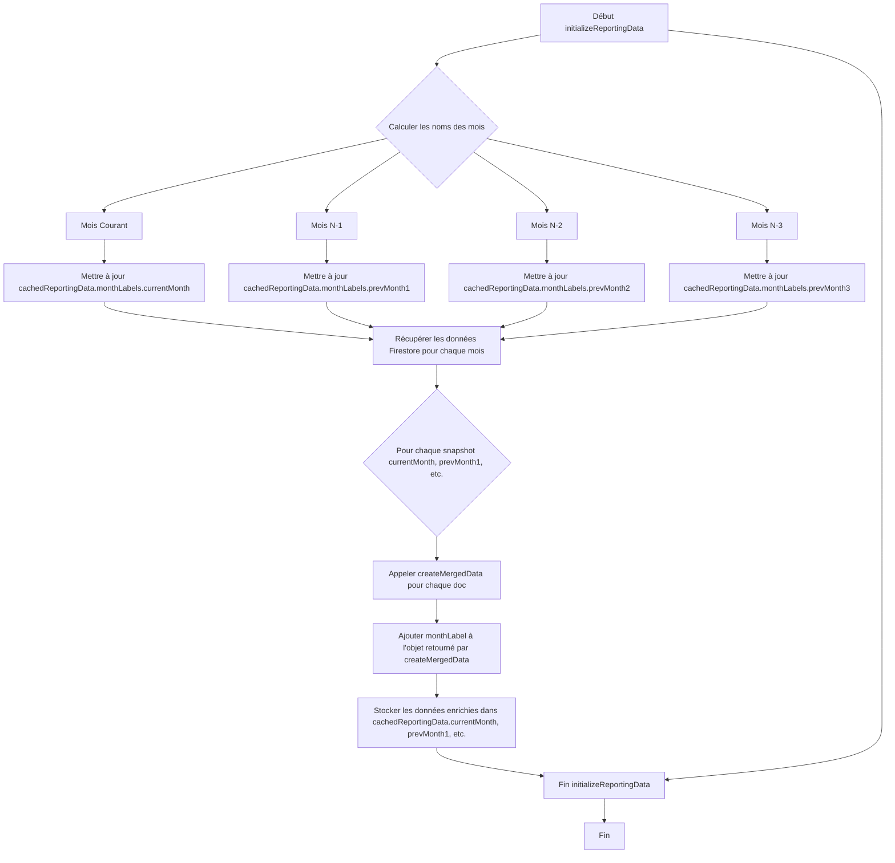

# Plan d'ajout du champ "monthLabel" à cachedReportingData

## Objectif
Ajouter un champ `monthLabel` à l'objet `cachedReportingData` dans `utils/dataStore.ts`. Ce champ contiendra le nom du mois (par exemple, "Janvier", "Février"), calculé à partir des dates implicites des collections Firestore.

## Contexte
L'objet `cachedReportingData` est peuplé par la fonction `initializeReportingData` en récupérant des données de collections Firestore nommées `DataMoisN`, `DataMoisN-1`, `DataMoisN-2`, et `DataMoisN-3`. Actuellement, `cachedReportingData` inclut une structure `monthLabels` qui est vide.

## Plan d'action

### 1. Modification de l'interface `ReportingEntry`
*   Ajouter un champ `monthLabel?: string;` à l'interface `ReportingEntry` pour qu'elle puisse stocker le nom du mois.

### 2. Modification de la fonction `initializeReportingData`

#### 2.1. Calcul des noms de mois
Au début de la fonction `initializeReportingData`, calculer les noms des mois pour le mois courant et les trois mois précédents.
*   Obtenir la date actuelle.
*   Pour chaque mois (courant, N-1, N-2, N-3), créer une instance `Date` correspondante.
*   Formater cette date pour obtenir le nom du mois en français (par exemple, "Janvier", "Février") en utilisant `toLocaleString`.

#### 2.2. Mise à jour de `cachedReportingData.monthLabels`
Assigner les noms de mois calculés aux propriétés correspondantes dans `cachedReportingData.monthLabels`.

#### 2.3. Ajout du `monthLabel` aux données
Lors du `map` des `querySnapshot.docs` pour peupler `cachedReportingData.currentMonth`, `prevMonth1`, etc., ajouter un nouveau champ `monthLabel` à chaque objet `ReportingEntry` avec le nom de mois approprié à la collection d'origine. Cela sera fait en modifiant la fonction `createMergedData` ou en ajoutant le champ juste après l'appel à `createMergedData`. La modification de `createMergedData` est privilégiée pour centraliser la logique.

## Diagramme Mermaid

